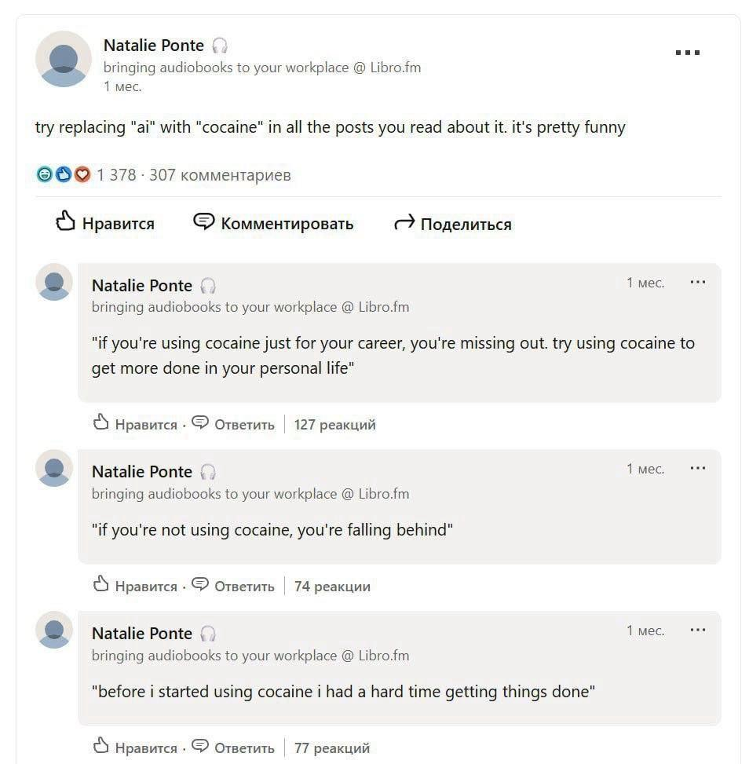

    

    

## Introduction

AI2Cocaine is a simple browser extension that replaces webpage mentions of AI with Cocaine. Do you feel the web has too much AI and not enough Cocaine? AI2Cocaine helps you achieve a more balanced browsing experience.

## Example

## Install on Chrome

You can install AI2Cocaine on Chrome as an unpacked extension.

1. Download this project (either as ZIP or via `git clone`).
2. Go to `chrome://extensions` via the address bar.
3. Enable developer mode if it hasn't already been enabled.
4. Click "Load unpacked". Chrome will prompt you for a specific directory. Select the `src/` directory.

## Install on Firefox

You can install AI2Cocaine on Firefox [here](https://addons.mozilla.org/en-US/firefox/addon/ai2cocaine/) via addons.mozilla.org.

Alternatively, you can install AI2Cocaine as a temporary addon by following the steps below. You will have to reinstall the extension every time Firefox restarts.

1. Download this project (either as ZIP or via `git clone`).
2. Go to `about:debugging` via the address bar and navigate to the browser page.
3. Within the "Temporary Extensions" section, click "Load Temporary Add-on..." Firefox will prompt you for a specific file. Select the `manifest.json` file in the `src/` directory.

## Install on other browsers

Installing AI2Cocaine on other Blink-based browsers such as Edge and Opera should be similar to installing on Chrome. However, I have not tested AI2Cocaine on browsers other than Chrome and Firefox.

## It doesn't work!

Make sure AI2Cocaine is enabled and has permission to access all websites' data. Also, if you are using Incognito or Private Browsing, make sure AI2Cocaine is allowed in that mode. Finally, if you installed AI2Cocaine as an unpacked Chrome extension, make sure you didn't move or delete the `src/` directory containing the extension files. To fix this, re-install the extension.

## Acknowledgements

Thanks to [@astral4](https://github.com/astral4) for the code and a LinkedIn user for the idea

